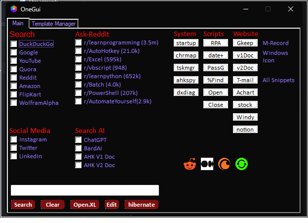
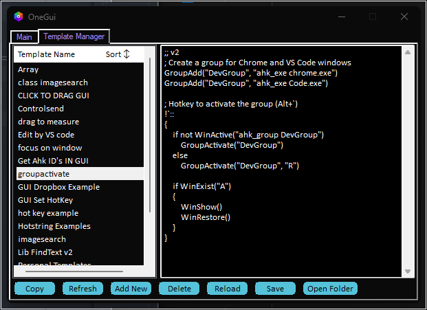
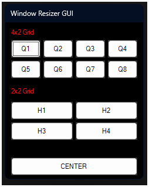
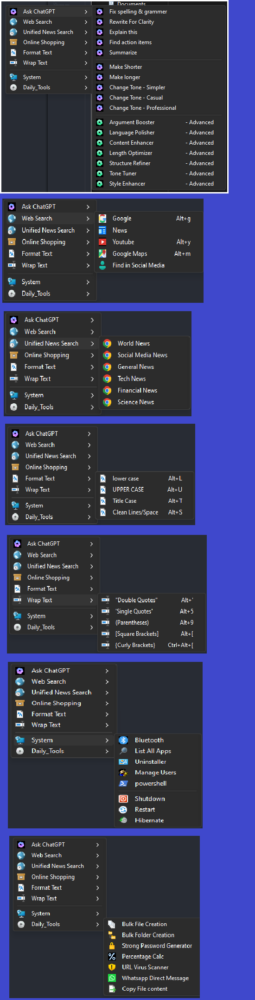
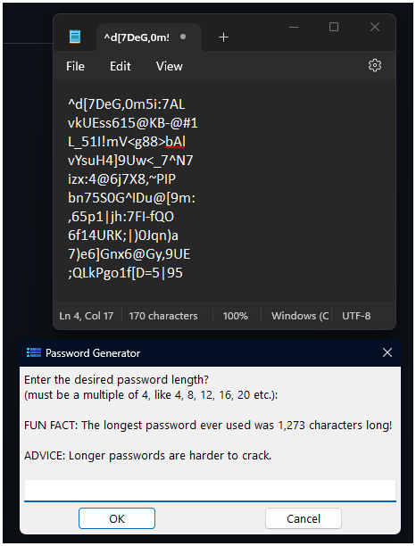

# My_Project_PNG

## 💡ONE GUI Tab-1:

## ONE GUI Templates Manager Tab-2 :

 

## Any Selected Window Resizer GUI:

## 💡Action Menu:

## 💡Password Generater:

[code sample You can use numbers for reference-style link definitions][1]

Or leave it empty and use the [link text itself].

[arbitrary case-insensitive reference text]: https://www.mozilla.org
[1]: http://slashdot.org
[link text itself]: http://www.reddit.com
